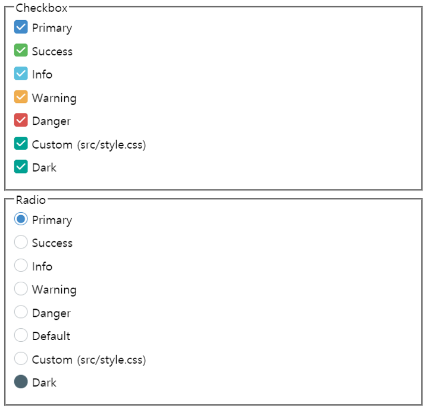

[](https://travis-ci.org/satrec-initiative/satreci-ngx-pretty-checkbox)
[](https://sonarcloud.io/dashboard?id=satrec-initiative_satreci-ngx-pretty-checkbox)

# satreci-ngx-pretty-checkbox

satreci-ngx-pretty-checkbox 은 [pretty-checkbox](https://lokesh-coder.github.io/pretty-checkbox/) 의 스타일을 적용한 체크박스/라디오 컨트롤을 Angular 컴포넌트로 제공합니다.

## Visuals



## Angular Support

> 이 라이브러리는 Angular 5부터 지원합니다.

## Installation

```bash
npm install satreci-ngx-pretty-checkbox pretty-checkbox --save
```

.angular-cli.json

```javascript
{
  ...
  "apps": [
    {
      ...
      "styles": [
        ...
        "../node_modules/pretty-checkbox/dist/pretty-checkbox.min.css",
        ...
        "styles.css"
      ],
      ...
    }
  ]
  ...
}
```

Angular 모듈 파일 (app.module.ts)

```javascript
import { NgModule } from '@angular/core';
import { BrowserModule } from '@angular/platform-browser';
import { SiNgxPrettyCheckboxModule } from 'satreci-ngx-pretty-checkbox';
import { AppComponent } from './app.component';
@NgModule({
    declarations: [AppComponent],
    imports: [
      BrowserModule,
      ...
      SiNgxPrettyCheckboxModule,
      ...],
    bootstrap: [AppComponent]
})
export class AppModule { }
```

## Usage

컴포넌트 내 사용 예시 (app.component.ts)

```javascript
import { Component } from '@angular/core';
@Component({
    selector: 'app',
    template: `
        <!-- checkbox -->
        <si-checkbox [(ngModel)]="checkboxState" name="c-success" checkboxClass="p-success">Success</si-checkbox>
        <si-checkbox [(ngModel)]="checkboxState" name="c-success" checkboxClass="p-success">Success</si-checkbox>
        <!-- radio -->
        <si-radio [(ngModel)]="radioValue" name="si-radio" value="primary" radioClass="p-primary-o">Primary</si-radio>
        <si-radio [(ngModel)]="radioValue" name="si-radio" value="success" radioClass="p-success-o">Success</si-radio>
    `
})
export class AppComponent {
    checkboxState: boolean = false;
    radioValue: string = 'primary';
}
```

## Examples

[Codesandbox](https://codesandbox.io/s/github/satrec-initiative/satreci-ngx-pretty-checkbox)

## Support

Github의 issue 페이지에서 이슈를 생성하거나, [yhjang@satreci.com](yhjang@satreci.com) 으로 도움을 요청해주세요.

## Contributing

이 라이브러리를 보다 더 완벽하게 해주는 Contribution은 언제든 환영합니다!

## Authors

[PRKM](https://gist.github.com/PRKM)

## License

[MIT](https://choosealicense.com/licenses/mit/)
